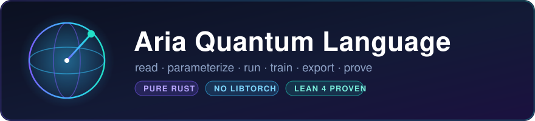

<div align="center">



# Aria Quantum Language

**A small, readable language for quantum circuits — a model you can _read,
parameterize, run, train, export, and prove_ from one source — on a pluggable,
pure-Rust runtime that needs no libtorch and is backed by Lean 4 correctness proofs.**


`APACHE-2.0` · `PURE RUST` · `NO LIBTORCH` · `LEAN 4 PROVEN` · `31/32 VERIFIED` · see [LICENSE](./LICENSE)

🔗 **https://github.com/Anzaetek/aria-quantum-language-oss-public**

</div>

> 💡 **One source, many targets.** A circuit parses to a backend-agnostic IR and
> then *runs* (CPU / MPS / GPU / libtorch / remote), *trains* its `symbolic[k]`
> angles with parameter-shift gradients in pure Rust, and *exports* to OPENQASM
> 2.0, JSON, or machine-checked Lean 4 — all from the same readable source.

---

**Aria** is a small, readable domain-specific language for quantum circuits — a
quantum model you can *read, parameterize, run, train, and export* from a single
source. It ships with a pluggable, pure-Rust execution runtime (the bundled
[omega-functions](crates/) engine) and trains variational/QML models with **no
libtorch required**.

```text
circuit Bell() {
    qreg q[2]
    creg c[2]
    apply H on q[0]
    apply CX on q[0], q[1]
    measure q[0] -> c[0]
    measure q[1] -> c[1]
}
```

```console
$ aria run examples/aria/bell.aria --circuit Bell --statevector
|00>  +0.707107+0.000000i
|11>  +0.707107+0.000000i

$ aria run examples/aria/bell.aria --circuit Bell --expectation "Z0 Z1"
<Z0 Z1> = 1.000000000000
```

## What's here

```
aria-quantum-language-oss/
├── crates/
│   ├── aria-core/        lexer · parser · AST · IR · QASM/JSON/Lean/Rocq export
│   ├── aria-runtime/     lowering + the pluggable Backend trait (run / train)
│   ├── aria-cli/         the `aria` binary: list · parse · run · train · export
│   ├── aria-verify/      application harnesses: quantum vs classical oracle
│   ├── apps/<name>/      one small crate per example (~60 readable lines)
│   └── omega-*/          vendored pure-Rust runtime: IR + backends + server
├── examples/aria/        32 example circuits (each header cites its harness + check)
├── proofs/lean4/         Lean 4 correctness theorems (sorry-free)
├── editors/              Aria syntax: tree-sitter · Neovim · VS Code
├── TUTORIAL.md · GRAMMAR.md · VERIFICATION.md · LIMITATIONS.md · TESTING.md
└── ci.sh                 the whole pipeline (local by design — no hosted runner)
```

## Why Aria

- **One source, many targets.** A circuit parses to a backend-agnostic IR and
  exports to OPENQASM 2.0, JSON, or Lean 4 — or runs directly.
- **Trainable by design.** `symbolic[k]` declares trainable angles; `aria train`
  optimizes them with parameter-shift gradients on a pure-Rust simulator.
- **Pluggable, performant runtime.** Execution goes through one trait
  (`omega_core::executor::Backend`). The default is a pure-Rust CPU statevector;
  MPS, GPU (Metal/CUDA/OpenCL), libtorch (`tch`), and a remote omega-server are
  drop-in backends behind the same contract.

## Quick start

```console
# Build the CLI
$ cargo build -p aria-cli            # produces target/debug/aria

# Inspect / run / export
$ aria list   examples/aria/qft.aria
$ aria parse  examples/aria/qft.aria --int n=3
$ aria run    examples/aria/qft.aria --circuit QFT --int n=3 --statevector
$ aria run    examples/aria/bell.aria --circuit Bell --shots 4096 --backend mps
$ aria export examples/aria/bell.aria --circuit Bell --qasm

# Train a variational model (pure Rust, no libtorch).
# VQE: recover the H2 ground-state energy (exact min = -1.851199).
$ aria train examples/aria/vqe_ansatz.aria --circuit VQEAnsatz --int n_layers=2 \
      --observable "-0.4804*I0+0.3435*Z0+-0.4347*Z1+0.5716*Z0Z1+0.0910*X0X1+0.0910*Y0Y1"
```

## Learn the language

- **[`TUTORIAL.md`](TUTORIAL.md)** — a hands-on tour (Bell → GHZ → QFT →
  `when` → trainable ansätze → backends → QASM/Lean export), every command real
  with its numeric output.
- **[`GRAMMAR.md`](GRAMMAR.md)** — the complete language reference (lexical
  structure, statements, expressions, the gate set, observables, annotations,
  and an EBNF grammar).

## Architecture

| Crate | Role |
|-------|------|
| `aria-core` | Lexer, parser, AST, `Circuit` IR, QASM/JSON/Lean/Rocq export. No runtime deps. |
| `aria-runtime` | Lowers `Circuit` → omega `CircuitIR`; runs/trains via a pluggable `Backend`. |
| `aria-cli` | The `aria` binary: `list` / `parse` / `run` / `train` / `export`. |
| `omega-*` | The vendored omega-functions runtime: core IR + simulation backends + server. |

### Backends (the plugin contract)

Every backend implements `omega_core::executor::Backend`
(`execute` / `expectation` / `adjoint_gradient`). Select with `--backend`:

| `--backend` | Crate | Status | Notes |
|-------------|-------|--------|-------|
| `sim` (default) | `omega-backend-statevector` | ✅ | Pure-Rust CPU statevector, exact |
| `mps` | `omega-backend-mps` (+ `-mps-cuda`) | ✅ | Pure-Rust MPS, scales with bounded entanglement. Under `--features cuda`, bond-compression SVD runs on the GPU (cuSOLVER `gesvdj`) with CPU fallback |
| `gpu` | `omega-backend-statevector-{metal,cuda,opencl}` | ✅ | Build `--features metal` (or `cuda`/`opencl`); auto-falls back to `sim` if the device is unavailable |
| `pauliprop` | `omega-backend-pauliprop` (+ `-pauliprop-cuda`) | ✅ | Heisenberg Pauli-propagation; **expectation values only**. Exact & width-unbounded on Clifford; truncate deep non-Clifford with `--truncate C --max-weight W --max-freq F` (certified dropped-mass error bound). Under `--features cuda` the non-Clifford branch step runs on the GPU with CPU fallback |
| `remote` | omega-server HTTP | ✅ | `--features remote`, then `--backend remote --url …`; delegate to a running omega-server |
| `tch` | `aria-backend-tch` | ✅ | `--features tch` (needs `LIBTORCH`); a libtorch `tch::Tensor` statevector. `aria run/train --backend tch` |

```console
$ cargo run -p aria-cli --features metal -- run examples/aria/qft.aria \
      --circuit QFT --int n=3 --backend gpu --statevector

# NVIDIA CUDA (statevector, MPS-SVD, and pauliprop branch all GPU-accelerated):
$ cargo run -p aria-cli --features cuda -- run examples/aria/qft.aria \
      --circuit QFT --int n=4 --backend gpu --statevector
$ cargo run -p aria-cli --features cuda -- run examples/aria/bell.aria \
      --circuit Bell --expectation "Z0 Z1" --backend pauliprop --max-freq 6
```

Every GPU path is **optional and falls back to the CPU** when the feature is off
or no device is present, so the default build stays pure-Rust and portable.

**Pauli propagation** (`--backend pauliprop`) follows the PauliPropagation.jl
paradigm — it back-propagates the observable as a truncated sum of weighted Pauli
strings, with all three of PP.jl's truncation axes (`coeff_min`, `max_weight`,
`max_freq`) and a certified L1 dropped-mass error bound. The engine is shared with
the omega-functions toolkit; see [`crates/omega-backend-pauliprop`](crates/omega-backend-pauliprop)
and, for the fuller feature set (stabilizer tableau, ECC, `quantum expect`/`ecc`
subcommands), the upstream `omega-functions` crates.

To embed your own high-performance simulator, implement `Backend` and register a
variant in `aria-runtime`'s `BackendSel` — no changes to the language core.

## QML / training

Aria's trainable parameters (`symbolic[k]`) flow end-to-end without libtorch:

```text
aria  symbolic[k]  →  ParamExpr::Symbol  →  omega SymbolId  →  ParameterBinding
                   parameter-shift gradients (omega-core) + gradient descent
```

The libtorch (`tch`) backend is an **optional accelerator** for large, batched
models — the default training path is pure Rust and numerically verified (the
shipped `VQEAnsatz` recovers the exact H₂ ground-state energy to ≤ 1e-3).

## Application harnesses (`aria-verify`)

Each shipped example also runs as a **real application** and is cross-checked
against a pure-Rust oracle, so it is always obvious *what* is computed and that
the quantum and classical results agree numerically. Two oracle kinds are used:
a **classical** one where a closed-form algorithm gives the ground truth (DFT,
SVD, max-cut, recovered bits/phase, …), and a **differential** one for
parametrized circuits with no closed-form answer, where an independent pure-Rust
statevector simulator reproduces the full `⟨Z_q⟩` profile. **31 of 32 examples
are numerically verified** (the 32nd, `shor_ecdlp`, is a parse-only showcase) —
the full table is in [`VERIFICATION.md`](VERIFICATION.md), boundaries in
[`LIMITATIONS.md`](LIMITATIONS.md).

```text
.aria  →  lower to omega IR  →  run THROUGH the omega WASM runtime (in-process)
                              →  compare to a classical oracle  →  PASS/FAIL
```

**Each example is its own small crate** under
[`crates/apps/<name>`](crates/apps/) — open `crates/apps/qsvd/src/lib.rs` and
the whole harness is right there (~60 readable lines). The matching `.aria`
file points straight at it in its header, e.g.:

```aria
-- ▶ Application harness + classical cross-check: crates/apps/qsvd/src/lib.rs
--   run: cargo run -p aria-app-qsvd   (or: cargo run -p aria-verify -- qsvd)
```

The reusable bits (banner, classical oracles, the `.aria`→wasm glue) live once
in [`crates/aria-verify-core`](crates/aria-verify-core); `aria-verify` is just a
thin runner over the per-example crates.

```bash
# Build the WASM guests once, then verify every example (31/32 numeric; 1 showcase):
( cd examples/wasm-guests/vqe       && cargo build --target wasm32-wasip1 --release )
( cd examples/wasm-guests/omega_app && cargo build --target wasm32-wasip1 --release )
cargo run -p aria-verify -- all          # all examples
cargo run -p aria-verify -- qsvd         # one, via the runner
cargo run -p aria-app-qsvd               # the same one, standalone crate
```

For example, `qsvd` variationally diagonalizes an explicit matrix `M` inside
`vqe.wasm` and checks the singular values against a Jacobi SVD; `qml_classifier`
trains a data-reuploading model, runs **inference in wasm**, and prints a
confusion matrix vs the ground-truth labels. The same package can also be driven
over a **socket** to a running `omega-server`:

```bash
cargo run -p aria-verify --features remote -- socket --url http://127.0.0.1:8899 --token "$(cat tok)"
```

The in-process ("all in one") transport is canonical; the socket path is the
networked variant. See [`TESTING.md`](TESTING.md) §13–14 for the numeric goldens.

## Formal proofs (`proofs/lean4`)

`aria export <file> --circuit NAME --lean` emits Lean 4 that imports
`QuantumProofs.CircuitSemantics` / `QuantumProofs.Gates`. Those modules — the
minimal proof subtree that makes the export self-contained — live under
[`proofs/lean4/QuantumProofs/`](proofs/lean4/QuantumProofs/), together with the
**proven correctness theorems** for the algorithms whose `.aria` examples ship
here:

- **Bell state-prep** — `BellPrep.lean`: `denote bell_circuit` on `|00⟩` is
  `(|00⟩+|11⟩)/√2`, and the circuit is unitary.
- **Circulant solver via QFT** — `CirculantSolve.lean` (the `circulant.aria`
  reproduction):
  - `qft_diagonalizes_circ2` — the QFT unitary diagonalizes the 2×2 circulant to
    `diag(a+b, a−b)` (its eigenvalues), the same `Λ` the classical
    `omega-core::circulant::solve_via_dft` uses.
  - `circ2_solve_operator` — the full solve operator `Fᴴ·Λ⁻¹·F = C⁻¹` (QFT →
    scale by `1/λ` → inverse-QFT).
  - `circ2_solve_noise_deviation` — **noise model:** a noisy solver applying
    imperfect reciprocals `μ = 1/λ + ε` deviates from `C⁻¹` by exactly the
    QFT-conjugated error `Fᴴ·diag(ε)·F`, linear in `ε`, → 0 as noise → 0.

All sorry-free (`#print axioms` shows only the three standard axioms) — but note
the *enforcement* is opt-in: `ARIA_LEAN=1 ./ci.sh` (or `cd proofs/lean4 && lake
exe cache get && lake build`) builds the tree and runs the `#print axioms`
sorry-free gate. The **default** `./ci.sh` does not build Lean (it needs a
mathlib cache); it runs only the Rust-side emitter/drift unit tests. The Rust
kernel tests in `omega-core` (`n2_eigenvalues_match_proven_lean_corr1`,
`n2_noisy_solve_deviation_matches_proven_lean`) numerically anchor these
theorems and *do* run in default CI. See [`proofs/lean4/README.md`](proofs/lean4/README.md).

## Editors

Syntax support for the `.aria` quantum dialect lives in [`editors/`](editors/):
a Tree-sitter grammar, a Neovim plugin, and a VS Code TextMate grammar.

## Building & testing

`./ci.sh` is the single source of truth (format, clippy `-D warnings`, build,
numeric tests, and a built-binary smoke check). All acceptance is numeric.

CI is **local by design** — `./ci.sh` is the whole pipeline; there is no
GitHub Actions / hosted runner. Run it before sending a change. `ARIA_LEAN=1
./ci.sh` additionally builds the Lean proof tree (needs a warm mathlib cache).

## Contributing & contact

Patches and questions are welcome by email to **aria@anzaetek.com** — there is
no public issue tracker for this mirror. Please run `./ci.sh` green first.

## License

Apache-2.0. See [LICENSE](LICENSE) and [NOTICE](NOTICE). This project is the Aria
language and gate-model runtime. It ships no MBQC example programs and none of the
proprietary circuit-to-pattern (gflow) compiler. The vendored omega-functions
photonic backend retains a reference one-way (cluster-state) pattern executor.
